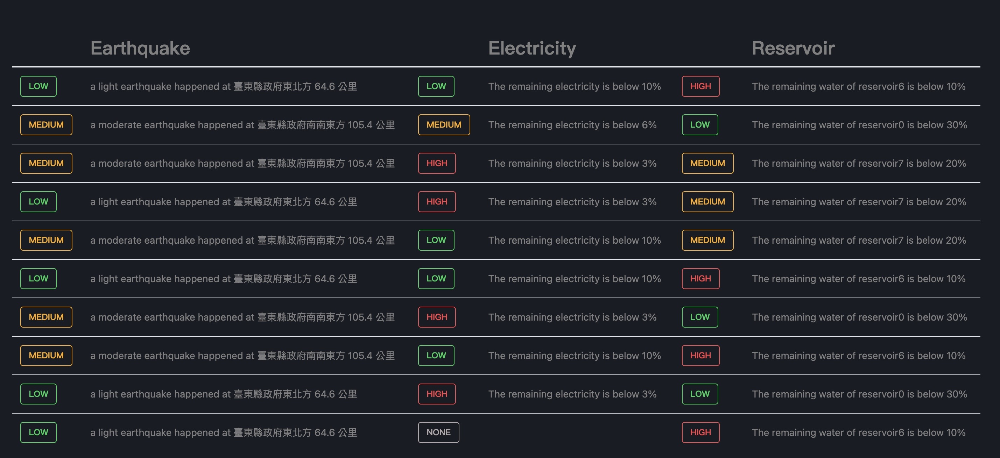

# Cloud_Native-Project

Guides for users:

- Install the required packages.

    ``` sh
    pip install -r requirements.txt
    ```

- Crawl the data of reservoirs.

    ``` sh
    cd reservoir
    python3 reservoir.py
    ```

- Crawl the data of electricity.

    - Codes related to electricity service are under electricity
    
    - How to run service
    ``` sh
    cd electricity
    python3 electricity.py
    ```

    - Build docker container of electricity service
    ```
    make all Makefile
    ```
    - Clear docker container and image of earthquake
    ```
    make clean Makefile
    ```
    - How to run unit test
    ```
    cd electricity/test
    python3 test_electricity.py
    ```
- crawl the data of erathquake.

    ``` sh
    cd earthquake
    python3 erathquake.py
    ```
    - Build docker container of erathquake
    ```
    make
    ```
    - Clear docker container and image of earthquake & Clear firestore data of earthquake
    ```
    make clean
    ```

Guides for developers:
- [How to write to firestore?](/write_to_firestore.pdf)

- alarm service 
    - 目前有兩個功能
        1. 偵測
          - 根據 earthquake、electricity、reservoir collections 產生 alarm 並存入 alarms collection
          - 每個 alarm 有以下四個欄位：
            - description：描述性文字，將會顯示於警報頁面上
            - order：從1開始、由小到大排序，越久的 alarm 此欄位會越大，當 alarm 超過 10 的時候將被刪除
            - service："svc_earthquake" / "svc_electricity" / "svc_reservoir"
            - severity："low" / "medium" / "high"
          - 當任一 collection 更新就會自動偵測該 collection 並產生 alarms
          - 畫面重新整理時也會自動偵測所有的 collections 並產生 alarms
          
        2. 預覽
          - 可直接在瀏覽器上看到 alrams collection 的內容
          - 此預覽為即時更新，無需重新整理畫面
    - 使用方式
        ```
        cd alarm
        npm install
        npm start
        ```
    - FIXME: 
        - [ ] 畫面重新整理時不應該進行偵測
        - [ ] order 會重複
        - [ ] order 會超過10但沒被刪除
    - TODO:
        - [ ] 容器化
        - [ ] 水庫名稱要 mapping
        - [ ] 加入彈跳通知

- ui service
    - homepage: 將 alarms collection 的內容轉換以後顯示到畫面上，預設顯示前十筆，不足十筆則顯示 None，展示如下

        
    - 另有 earthquake, electricity, reservoir 等三個頁面

    - 使用方式
        ```
        <!-- use node v12.22.12 -->
        cd ui
        npm install
        npm start
        ```

        執行完畢後，預設將在 localhost:3000 開啟專案

---
## User Story

```
FEATURE: 網站導覽
AS A 使用者
I WANT 快速瞭解網站有哪些頁面
SO THAT 我可以找到自己要的資料

GIVEN 我正在網站裡
WHEN 進入首頁
THEN 應該要看到水庫資訊、電力資訊跟地震資訊的按鍵

GIVEN 我正在網站首頁
WHEN 點擊進入某個頁面的按鍵
THEN 應該要進入相對應的頁面
```

```
FEATURE: 回到首頁
AS A 使用者
I WANT 回到網站首頁
SO THAT 我可以進到其他頁面

GIVEN 我正在某一個子頁面
WHEN 我滑到頁面上特定的區域
THEN 應該要看到「首頁」按鍵

GIVEN 我正在某一個頁面
WHEN 點擊「首頁」
THEN 我應該回到網站首頁
```

```
FEATURE: 水庫剩餘量監控
AS A 廠務工程師
I WANT 即時查看水庫剩餘水量
SO THAT 我可以評估可能的供水危機

GIVEN 我正在網站首頁
WHEN 我進入水庫資訊頁面
THEN 應該要看到各水庫的剩餘水量及百分比
```

```
FEATURE: 電力負載狀況監控
AS A 廠務工程師
I WANT 即時查看電力負載狀況
SO THAT 我可以評估可能的供電危機

GIVEN 我正在網站首頁
WHEN 我進入電力頁面
THEN 應該要看到各地的即時供電量、用電量、供應人數以及人均用電量
```

```
FEATURE: 地震震度監控
AS A 廠務工程師
I WANT 查看最近的地震紀錄
SO THAT 我可以評估目前各地災情

GIVEN 我正在網站首頁
WHEN 我進入地震頁面
THEN 應該要看到近期地震之位置、深度、規模、強度
```

```
FEATURE: 警示水量異常
AS A 廠務工程師
I WANT 即時收到水量警示
SO THAT 我可以根據警示調整工廠的用水計畫

GIVEN 我正在網站裡
WHEN 某水庫剩餘水量低於30%或高於90%、低於20%、低於10%
THEN 網站分別會顯示輕微、中等、嚴重的水情警示
```

```
FEATURE: 警示電力不足
AS A 廠務工程師
I WANT 即時收到缺電警示
SO THAT 我可以根據警示調整工廠的用電策略

GIVEN 我正在網站裡
WHEN 剩餘電量少於 10%、6%、3%
THEN 網站分別會顯示輕微、中等、嚴重的缺電警示
```

```
FEATURE: 警示地震
AS A 廠務工程師
I WANT 即時收到地震警示
SO THAT 我可以根據警示制定緊急應對計劃

GIVEN 我正在網站裡
WHEN 地震發生
THEN 網站應該跳出地震警示

GIVEN 我正在網站裡
WHEN 地震發生且震度大於3級、4級、5級
THEN 網站分別會顯示輕微、中等、嚴重的地震警示
```