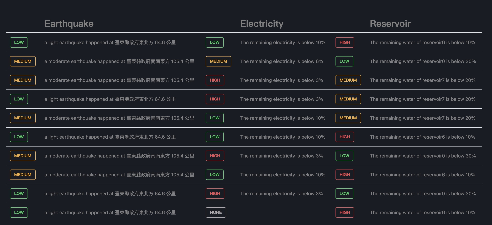

# Cloud_Native-Project

Guides for users:

- Install the required packages.

    ``` sh
    pip install -r requirements.txt
    ```

- Crawl the data of reservoirs.

    ``` sh
    cd reservoir
    python3 reservoir.py
    ```

- Crawl the data of electricity.

    ``` sh
    cd electricity
    python3 electricity.py
    ```

- crawl the data of erathquake.

    ``` sh
    cd earthquake
    python3 erathquake.py
    ```
    - Build docker container of erathquake
    ```
    make
    ```
    - Clear docker container and image of earthquake & Clear firestore data of earthquake
    ```
    make clean
    ```

Guides for developers:
- [How to write to firestore?](/write_to_firestore.pdf)

- alarm service 
    - 目前有兩個功能
        1. 偵測
          - 根據 earthquake、electricity、reservoir collections 產生 alarm 並存入 alarms collection
          - 每個 alarm 有以下四個欄位：
            - description：描述性文字，將會顯示於警報頁面上
            - order：從1開始、由小到大排序，越久的 alarm 此欄位會越大，當 alarm 超過 10 的時候將被刪除
            - service："svc_earthquake" / "svc_electricity" / "svc_reservoir"
            - severity："low" / "medium" / "high"
          - 當任一 collection 更新就會自動偵測該 collection 並產生 alarms
          - 畫面重新整理時也會自動偵測所有的 collections 並產生 alarms
          
        2. 預覽
          - 可直接在瀏覽器上看到 alrams collection 的內容
          - 此預覽為即時更新，無需重新整理畫面
    - 使用方式
        ```
        cd alarm
        npm install
        npm start
        ```
    - FIXME: 
        - [ ] 畫面重新整理時不應該進行偵測
        - [ ] order 會重複
        - [ ] order 會超過10但沒被刪除
    - TODO:
        - [ ] 容器化

- homepage service
    - 將 alarms collection 的內容轉換以後顯示到畫面上，預設顯示前十筆，不足十筆則顯示 None，展示如下
    - 
    
    

    - 使用方式
        ```
        cd homepage
        npm install
        npm start
        ```
    - FIXME:
        -  alarm 沒有依照 order 排序
    - TODO:
        - [ ] 容器化